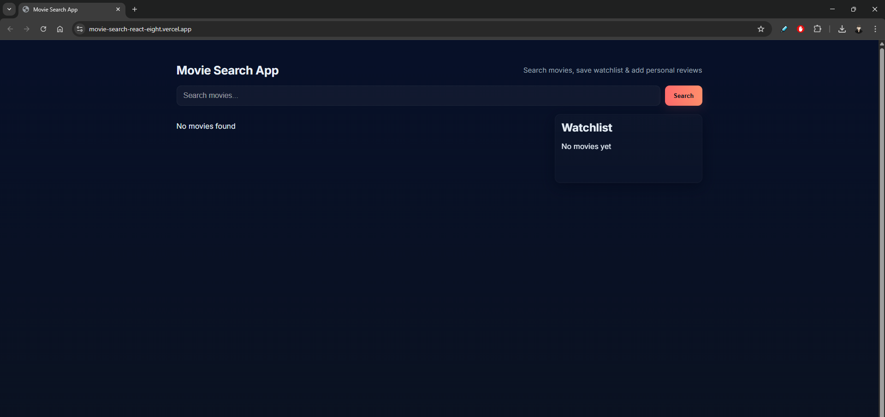
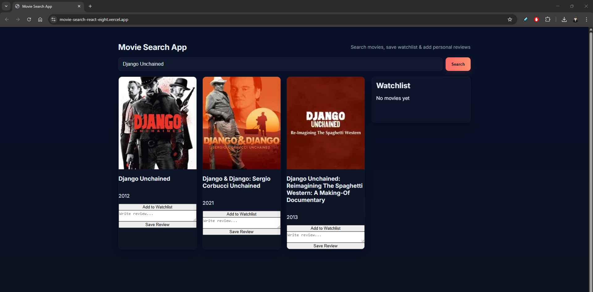

# 🎬 Movie Search App (React + Vite)

A fast and modern **Movie Search App** built with **React + Vite**, using the **TMDB API** to fetch movie details.  
Includes a **Watchlist**, **Personal Reviews**, and clean UI.

---

## Live Demo
🔗 Coming soon – will add after deployment on Vercel

---

## Features
- Search movies by name using TMDB API  
- View posters, titles, release year  
- Add movies to Watchlist  
- Add & save personal reviews (stored in LocalStorage)  
- Watchlist persists even after browser refresh  
- Fully responsive layout  
- Built with Vite → extremely fast

---

## Tech Stack
**Frontend:** React, Vite  
**API:** TMDB (The Movie Database)  
**HTTP Client:** Axios  
**Storage:** LocalStorage  
**Styling:** CSS  

---

## Screenshots (Add when ready)
Place images in a folder like:  
`/public/screenshots/`

Then add:

  
  


---

## Project Structure
```
movie-search-react/
├── src/
│   ├── components/
│   │   ├── SearchBar.jsx
│   │   ├── MovieGrid.jsx
│   │   ├── MovieCard.jsx
│   │   └── Watchlist.jsx
│   ├── lib/
│   │   ├── api.js
│   │   └── localstore.js
│   ├── App.jsx
│   ├── main.jsx
│   └── styles.css
├── .gitignore
├── index.html
├── package.json
└── README.md
```

---

## ⚙️ Setup & Installation

### 1️⃣ Clone the project
```
git clone https://github.com/gman-sudo/movie-search-react.git
cd movie-search-react
```

### 2️⃣ Install dependencies
```
npm install
```

### 3️⃣ Add TMDB API Key  
Create a `.env` file in project root:

```
VITE_TMDB_API_KEY=your_api_key_here
```

Get API key → https://www.themoviedb.org/settings/api

### 4️⃣ Run development server
```
npm run dev
```

App runs at: **http://localhost:5173**

---

## 📦 Build for Production
```
npm run build
```

This generates the `dist/` folder → deployable on Vercel/Netlify.

---

## ☁️ Deployment (Vercel Recommended)
1. Go to https://vercel.com/new  
2. Import this GitHub repo  
3. Set environment variable:  
   - `VITE_TMDB_API_KEY = your_api_key`  
4. Deploy

---

## 📌 Future Improvements (for portfolio)
- ⭐ Add movie ratings  
- ⭐ Add pagination  
- ⭐ Add filters (popular/top rated)  
- ⭐ Add backend for real stored reviews (Node.js + MongoDB)  
- ⭐ Add login + JWT auth  
- ⭐ Convert UI to Tailwind CSS or Material UI

---

## 👨‍💻 Author
**Gaganmanohar T**  
Full-Stack Developer  
🔗 GitHub: https://github.com/gman-sudo  
🔗 LinkedIn: https://www.linkedin.com/in/gaganmanohar-t
